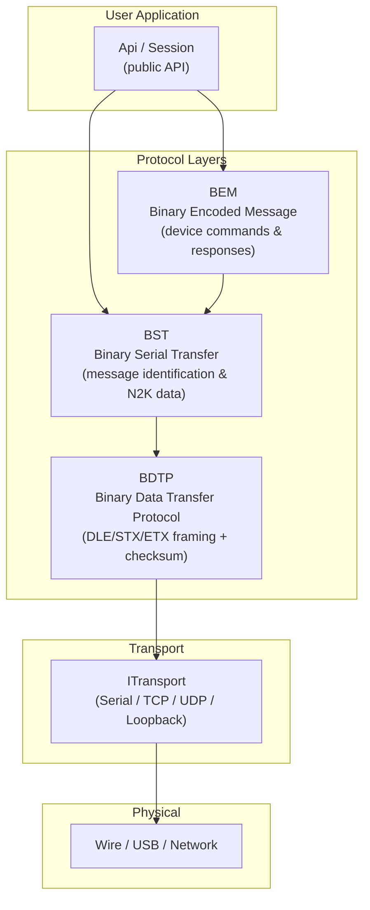
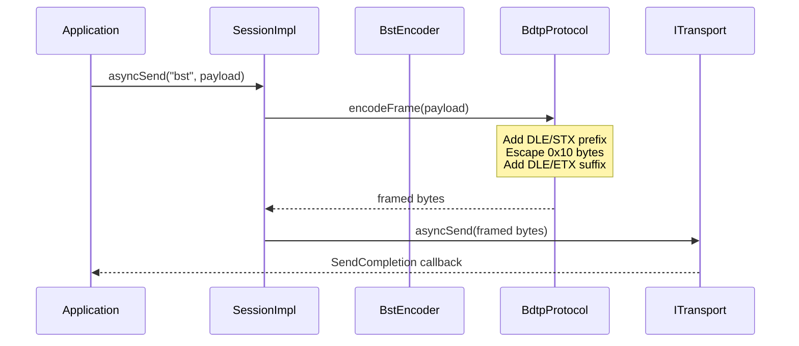
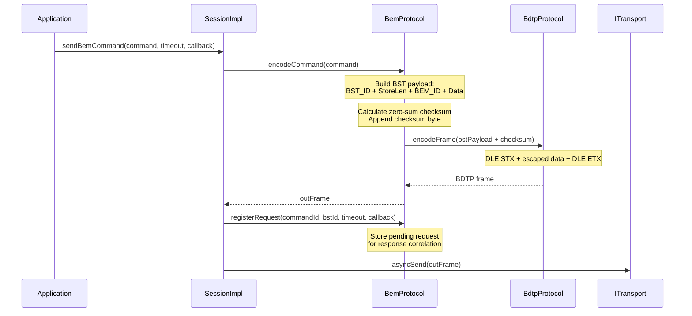
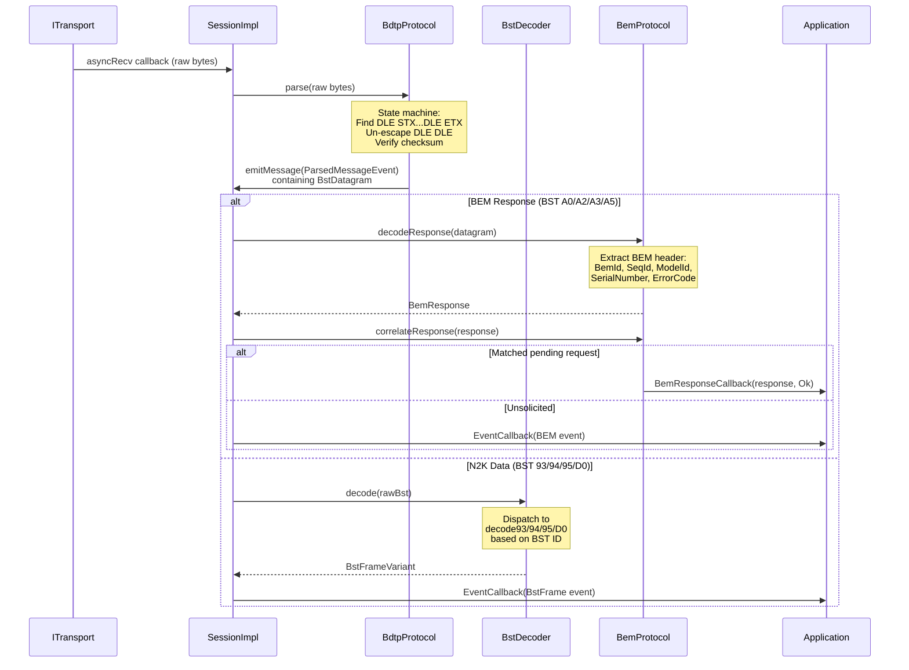
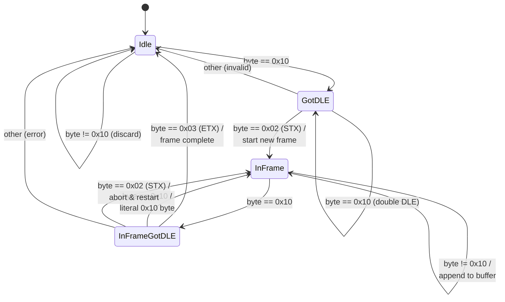
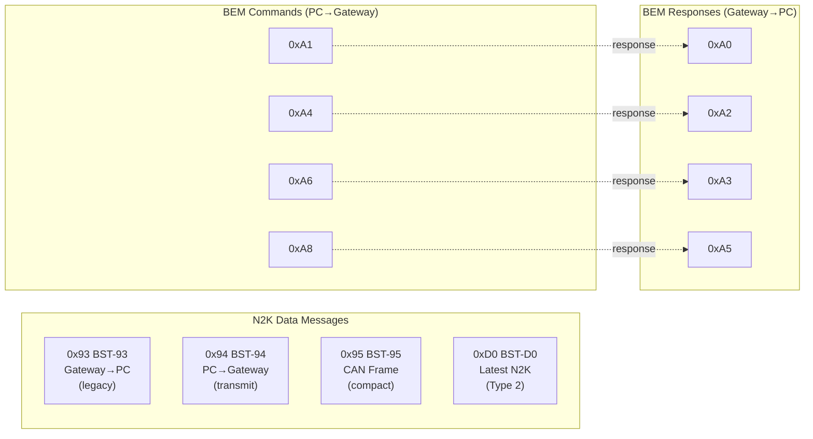
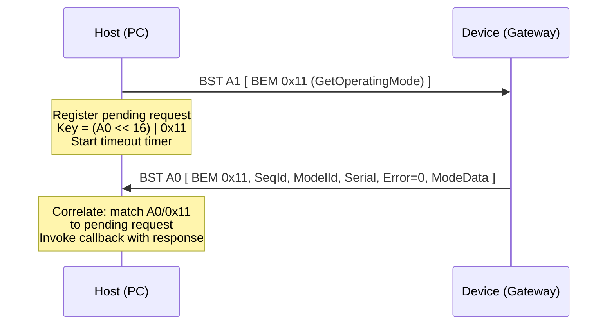
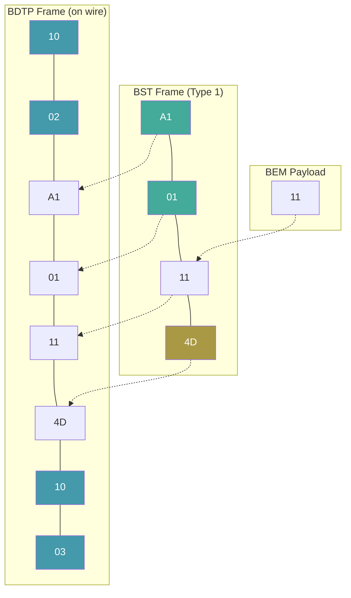
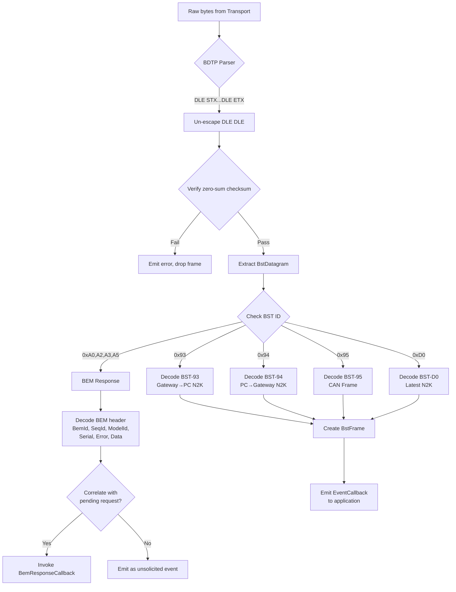
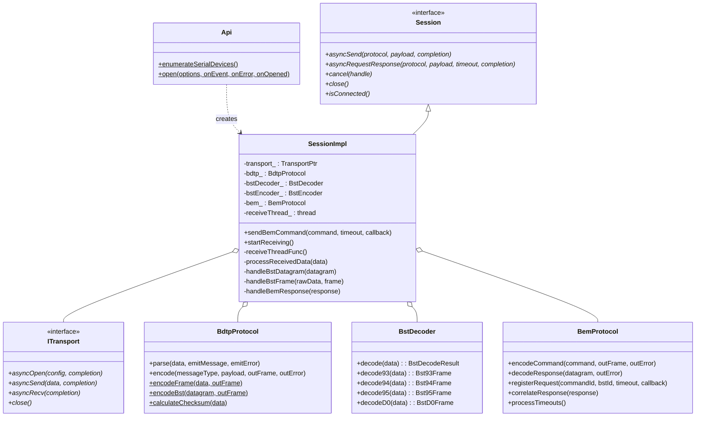

# Actisense SDK - Message Flow & Packetisation

This document describes how messages flow through the Actisense SDK protocol stack, from the public API down to raw bytes on the wire and back.

---

## 1. Protocol Stack Overview

The SDK uses a layered protocol architecture. Each layer adds structure, framing, or semantics on top of the one below it.



| Layer | Responsibility | Key Classes |
|-------|---------------|-------------|
| **API** | Session lifecycle, async send/receive, event dispatch | `Api`, `Session`, `SessionImpl` |
| **BEM** | Device command/response encoding, correlation, timeouts | `BemProtocol`, `BemCommand`, `BemResponse` |
| **BST** | Message type identification, N2K header fields, payload | `BstDecoder`, `BstEncoder`, `BstFrame` |
| **BDTP** | Byte-stream framing, DLE escaping, checksum | `BdtpProtocol` |
| **Transport** | Raw byte I/O over serial, TCP, UDP, or loopback | `ITransport`, `SerialTransport` |

---

## 2. Transmit Path (API to Wire)

### 2.1 NMEA 2000 Data Message (BST-94 / BST-D0)



### 2.2 BEM Device Command



---

## 3. Receive Path (Wire to API)



---

## 4. BDTP Layer - Wire Framing

BDTP (Binary Data Transfer Protocol) provides reliable framing over a raw byte stream using DLE-escaped delimiters.

### 4.1 Frame Format

```
 DLE  STX  [escaped payload bytes]  DLE  ETX
0x10 0x02  ...                      0x10 0x03
```

| Element | Bytes | Description |
|---------|-------|-------------|
| Frame start | `0x10 0x02` | DLE STX |
| Payload | Variable | Data with DLE escaping applied |
| Frame end | `0x10 0x03` | DLE ETX |

### 4.2 DLE Escaping

Any `0x10` byte within the payload is escaped by doubling it:

| Raw byte | On wire |
|----------|---------|
| `0x10` | `0x10 0x10` |
| Any other | Unchanged |

### 4.3 Parser State Machine



Maximum frame size: **512 bytes** (after un-escaping).

---

## 5. BST Layer - Message Identification

BST (Binary Serial Transfer) sits inside BDTP frames. It identifies message types and carries structured payload data. There are two format variants.

### 5.1 BST Type 1 (8-bit length)

Used for BST IDs `0x00`-`0xCF` (including N2K formats 0x93, 0x94, 0x95 and BEM commands/responses 0xA0-0xA8).

```
+----------+---------+------------------+----------+
| BST ID   | Length  | Payload          | Checksum |
| (1 byte) | (1 byte)| (Length bytes)   | (1 byte) |
+----------+---------+------------------+----------+
```

- **Length** = number of payload bytes only (excludes ID, length, and checksum)
- **Checksum** = value such that `sum(ID + Length + Payload + Checksum) == 0x00` (mod 256)

### 5.2 BST Type 2 (16-bit length)

Used for BST IDs `0xD0`-`0xDF` (modern format, e.g. BST-D0).

```
+----------+----------+----------+------------------+----------+
| BST ID   | Len Lo   | Len Hi   | Payload          | Checksum |
| (1 byte) | (1 byte) | (1 byte) | (TotalLen-3 bytes)| (1 byte) |
+----------+----------+----------+------------------+----------+
```

- **TotalLen** (16-bit LE) = total message length including ID byte and both length bytes (but excluding checksum)
- Payload length = TotalLen - 3
- Same zero-sum checksum algorithm

### 5.3 BST ID Table



---

## 6. BST N2K Message Formats

All N2K formats carry NMEA 2000 PGN data with CAN addressing fields. The PGN is computed from PDU fields:

- **PDU2** (PDUF >= 240): `PGN = (DataPage << 16) | (PDUF << 8) | PDUS`
- **PDU1** (PDUF < 240): `PGN = (DataPage << 16) | (PDUF << 8)` (PDUS is destination address)

### 6.1 BST-93 (Gateway to PC, Legacy)

Direction: **Device --> Host**. BST Type 1, ID = `0x93`.

```
Offset  Field           Size    Description
──────  ──────────────  ──────  ─────────────────────────────
0       Priority        1       Message priority (0-7)
1       PDUS            1       PDU Specific (group ext / dest)
2       PDUF            1       PDU Format
3       DP              1       Data Page (bits 0-1)
4       Destination     1       Destination address (0xFF = broadcast)
5       Source          1       Source address
6       Timestamp       4       Milliseconds (little-endian)
10      DataLen         1       Length of following data
11      Data            N       PGN payload bytes
```

### 6.2 BST-94 (PC to Gateway)

Direction: **Host --> Device**. BST Type 1, ID = `0x94`. No source or timestamp (gateway assigns these).

```
Offset  Field           Size    Description
──────  ──────────────  ──────  ─────────────────────────────
0       Priority        1       Message priority (0-7)
1       PDUS            1       PDU Specific
2       PDUF            1       PDU Format
3       DP              1       Data Page (bits 0-1)
4       Destination     1       Destination address
5       DataLen         1       Length of following data
6       Data            N       PGN payload bytes
```

### 6.3 BST-95 (Compact CAN Frame)

Direction: **Bidirectional**. BST Type 1, ID = `0x95`. Compact format with 16-bit timestamp and combined control byte.

```
Offset  Field           Size    Description
──────  ──────────────  ──────  ─────────────────────────────
0       Timestamp       2       16-bit timestamp (little-endian)
2       Source          1       Source address
3       PDUS            1       PDU Specific
4       PDUF            1       PDU Format
5       DPPC            1       Combined control byte (see below)
6       Data            0-8     CAN payload (max 8 bytes)
```

**DPPC byte layout:**

```
Bit 7       Bit 6-5           Bit 4-2       Bit 1-0
Direction   TimestampRes      Priority      DataPage
(Rx/Tx)     (1ms/100us/       (0-7)         (0-3)
             10us/1us)
```

### 6.4 BST-D0 (Latest NMEA 2000)

Direction: **Bidirectional**. BST Type 2 (16-bit length), ID = `0xD0`. Full control information including fast-packet support.

```
Offset  Field           Size    Description
──────  ──────────────  ──────  ─────────────────────────────
0       Destination     1       Destination address (0xFF = broadcast)
1       Source          1       Source address
2       PDUS            1       PDU Specific
3       PDUF            1       PDU Format
4       DPP             1       DataPage + Priority byte (see below)
5       Control         1       Message type + flags (see below)
6       Timestamp       4       Milliseconds (little-endian)
10      Data            N       PGN payload (up to 1785 bytes)
```

**DPP byte layout:**

```
Bit 7-5       Bit 4-2       Bit 1-0
Spare         Priority      DataPage
              (0-7)         (0-3)
```

**Control byte layout:**

```
Bit 7-5           Bit 4          Bit 3        Bit 2     Bit 1-0
FastPacketSeqId   InternalSrc    Direction    Spare     MessageType
(0-7)             (0/1)          (Rx/Tx)               (Single/Fast/Multi/Unk)
```

---

## 7. BEM Layer - Device Commands & Responses

BEM (Binary Encoded Message) is the command/control protocol for configuring and querying Actisense devices. BEM messages are carried inside BST frames.

### 7.1 BEM Command Format (PC to Gateway)

Sent via BST IDs `0xA1`, `0xA4`, `0xA6`, `0xA8` (Type 1 framing).

```
BST payload:
+----------+------------------+
| BEM ID   | Command Data     |
| (1 byte) | (0-252 bytes)    |
+----------+------------------+
```

### 7.2 BEM Response Format (Gateway to PC)

Received via BST IDs `0xA0`, `0xA2`, `0xA3`, `0xA5` (Type 1 framing).

```
BST payload:
+----------+----------+----------+-----------+----------+------------------+
| BEM ID   | Seq ID   | Model ID | Serial #  | Error    | Response Data    |
| (1 byte) | (1 byte) | (2B LE)  | (4B LE)   | (4B LE)  | (0-N bytes)     |
+----------+----------+----------+-----------+----------+------------------+
  Offset 0     1          2          4            8          12
```

| Field | Size | Description |
|-------|------|-------------|
| BEM ID | 1 | Command ID this responds to |
| Seq ID | 1 | Sequence ID for correlation |
| Model ID | 2 | ARL device model code (LE) |
| Serial # | 4 | Device serial number (LE) |
| Error Code | 4 | ARL error code, 0 = success (LE) |
| Response Data | 0-N | Command-specific response payload |

### 7.3 Command/Response Correlation



BST command-to-response ID mapping:

| Command BST ID | Response BST ID |
|:-:|:-:|
| `0xA1` | `0xA0` |
| `0xA4` | `0xA2` |
| `0xA6` | `0xA3` |
| `0xA8` | `0xA5` |

### 7.4 BEM Command ID Summary

| ID | Name | Direction |
|----|------|-----------|
| `0x00` | ReInitMainApp | Command |
| `0x01` | CommitToEeprom | Command |
| `0x02` | CommitToFlash | Command |
| `0x11` | GetSetOperatingMode | Command |
| `0x13` | GetSetPortPCode | Command |
| `0x15` | GetSetTotalTime | Command |
| `0x17` | GetSetPortBaudrate | Command |
| `0x18` | Echo | Command |
| `0x40` | GetSupportedPgnList | Command |
| `0x41` | GetProductInfo | Command |
| `0x42` | GetSetCanConfig | Command |
| `0x43`-`0x45` | GetSetCanInfoField 1-3 | Command |
| `0x46` | GetSetRxPgnEnable | Command |
| `0x47` | GetSetTxPgnEnable | Command |
| `0x48`-`0x4F` | PGN List Management | Command |
| `0xF0` | StartupStatus | Unsolicited |
| `0xF1` | ErrorReport | Unsolicited |
| `0xF2` | SystemStatus | Unsolicited |
| `0xF4` | NegativeAck | Unsolicited |

---

## 8. Complete Packetisation Example

The following shows every byte added at each layer for a **BEM GetOperatingMode command** sent from the host.

### 8.1 BEM Layer

```
BEM Command:
  BEM_ID = 0x11 (GetSetOperatingMode)
  Data   = (empty for GET)

Payload: [11]
```

### 8.2 BST Layer (Type 1)

```
BST_ID      = 0xA1 (BEM PC→Gateway)
StoreLength = 0x01 (1 byte of payload)
Payload     = [11]
Checksum    = -(0xA1 + 0x01 + 0x11) mod 256 = 0x4D

BST bytes: [A1 01 11 4D]
```

### 8.3 BDTP Layer

```
DLE STX + escaped BST bytes + DLE ETX
No bytes are 0x10, so no escaping needed.

Wire bytes: [10 02 A1 01 11 4D 10 03]
              ^DLE ^STX              ^DLE ^ETX
```

### 8.4 Full Stack Diagram



**Legend:**
- Blue = BDTP framing (DLE/STX/ETX)
- Green = BST header (ID + Length)
- Red/Orange = Checksum
- White = Payload data

---

## 9. Receive Processing Pipeline



---

## 10. DLE Escaping Example

Suppose a BST payload contains the byte `0x10`. The BDTP layer escapes it:

```
BST payload:    [A1 01 10 xx]
                          ^^-- this 0x10 needs escaping

After BDTP framing:
[10 02  A1 01 10 10 xx  10 03]
 ^  ^              ^  ^   ^  ^
DLE STX         DLE DLE  DLE ETX
                (escaped)
```

On receive, the parser sees `DLE DLE` inside the frame and emits a single `0x10` byte.

---

## 11. Session Architecture



---

## 12. Summary of Layers

| Layer | Adds | Removes on Receive |
|-------|------|--------------------|
| **Transport** | Raw byte I/O | N/A |
| **BDTP** | `DLE STX` prefix, DLE escaping, `DLE ETX` suffix | Framing delimiters, un-escapes DLE |
| **BST** | BST ID (1B), Length (1-2B), Checksum (1B) | Extracts datagram, validates checksum |
| **BEM** (if applicable) | BEM ID (1B), command data | Extracts BEM header (12B), response data |
| **API** | Event typing, callbacks, async coordination | Delivers typed events to application |

**Total overhead per message:**
- BDTP: 4 bytes minimum (`DLE STX ... DLE ETX`) + escaping
- BST Type 1: 3 bytes (`ID + Len + Checksum`)
- BST Type 2: 4 bytes (`ID + LenLo + LenHi + Checksum`)
- BEM command: 1 byte (`BEM ID`)
- BEM response header: 12 bytes (`BEM ID + SeqId + ModelId + Serial + Error`)
